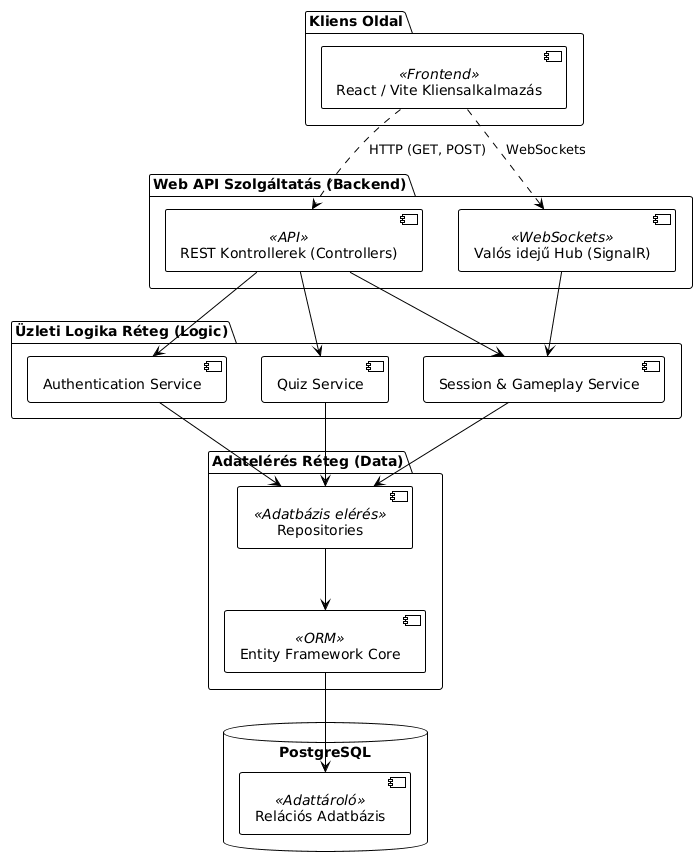
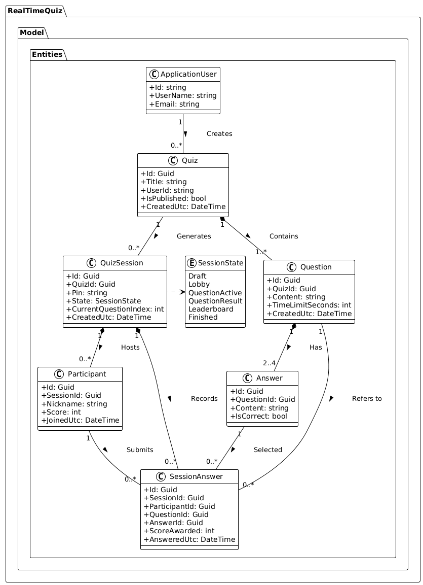
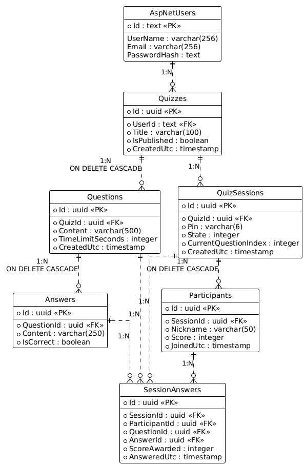

# RealTimeQuiz - Valós idejű kvízalkalmazás
## Webszolgáltatás fejlesztői dokumentációja

### 1. Címlap

**Fejlesztő adatai:**
*   Név: Horváth Dániel
*   Neptun kód: PM2PA1
*   Szak, Évfolyam: Programtervező informatikus, 1. évfolyam
*   Oktató / Konzulens neve: Ez szerintem nem kell mert ez nem szakdolgozat
*   Dátum: 2026. május 14.

---

### 2. Feladatleírás

A projekt célja egy valós idejű, webalapú kvízalkalmazás (hasonlóan a Kahoot platformhoz) háttérrendszerének (webszolgáltatásának) megtervezése és fejlesztése. A rendszer lehetővé teszi, hogy az adminisztrátorok (kvízmesterek) kvízeket és azokhoz tartozó interaktív kérdéseket hozzanak létre, majd ezeket egy valós idejű játékszakasz (session) keretében elindítsák. A játékosok egy generált PIN kód segítségével - regisztráció nélkül - csatlakozhatnak a játékhoz egy kliensalkalmazáson keresztül. A rendszer a kérdéseket, a beérkező válaszokat, valamint a pontozást és a ranglistát valós időben szinkronizálja a résztvevők között.

A fejlesztés során alkalmazott főbb technológiák:
*   **Keretrendszer:** .NET 8, ASP.NET Core Web API
*   **Adatelérés:** Entity Framework Core (Code-First megközelítés)
*   **Adatbázis:** PostgreSQL relációs adatbázis-kezelő rendszerek
*   **Valós idejű kommunikáció:** SignalR (WebSockets)
*   **Hitelesítés:** JWT (JSON Web Token) alapú autentikáció és autorizáció

---

### 3. Funkcionális elemzés

A rendszer két fő felhasználói szerepkört (aktort) különböztet meg:

**A) Rendszergazda / Kvízmester (Admin)**
*   **Hitelesítés:** Képes regisztrálni a rendszerbe, illetve meglévő fiókkal bejelentkezni, amelyért cserébe JWT hozzáférési tokent kap.
*   **Kvízmenedzsment (CRUD):** Jogosult új kvízek létrehozására, szerkesztésére, törlésére és lekérdezésére. Egy kvízhez tetszőleges számú kérdést és hozzájuk tartozó válaszlehetőségeket rögzíthet.
*   **Játékvezetés (Session kezelés):** Egy kiválasztott kvízből új játékmenetet (sessiont) indíthat. A játékmenet során a kvízmester indítja el a kérdéseket, zárja le a válaszadási lehetőséget, jeleníti meg a ranglistát, és végül lezárja magát a játékot.

**B) Résztvevő (Játékos)**
*   **Csatlakozás:** A kvízmester által publikált 6 számjegyű PIN kód és egy választott becenév megadásával csatlakozhat a játékhoz, fiók létrehozása nélkül.
*   **Interakció:** Valós időben kapja meg az aktuálisan megválaszolandó kérdést, amelyre a megadott időkereten belül választ küldhet be.
*   **Státuszkövetés:** Szintén valós időben értesül a válaszadás eredményéről (helyes/helytelen), az aktuális pontszámáról, és a globális ranglista állásáról.

---

### 4. Rendszer statikus terve

#### 4.1. UML Komponensdiagram

#### 4.2. UML Osztálydiagram

A rendszer tervezése során nagy hangsúlyt fektettünk az objektumorientált elvekre és a rétegelt architektúrára. Az osztálydiagram a legfontosabb entitásokat (Domain layer) és a köztük lévő kapcsolatokat mutatja be. Látható, hogy a `Quiz` entitás a központi eleme a statikus adatoknak, amelyhez `Question`, illetve azon belül `Answer` entitások kapcsolódnak kompozíciós viszonyban. A futási (valós idejű) adatok központi eleme a `QuizSession`, amely egy adott kvízhez kapcsolódik, és vezérli annak aktuális állapotát (`SessionState` enumeráció). A játékosok (`Participant`) ehhez a sessionhöz csatlakoznak, és a válaszaikat a `SessionAnswer` entitáson keresztül rögzítjük. A könnyebb átláthatóság érdekében a DTO-k (Data Transfer Objectek) nincsenek feltüntetve az ábrán.

---

### 5. Adatbázis felépítésének leírása

A rendszer a perzisztens adattároláshoz PostgreSQL relációs adatbázist használ. Az adatbázis sémájának kialakítása és menedzselése Entity Framework Core segítségével történik, "Code-First" megközelítéssel. Ez azt jelenti, hogy az adatbázis szerkezete és a köztük lévő kapcsolatok (idegen kulcsok) a C# nyelvű entitásosztályokból (modellekből) kerülnek legenerálásra migrációk formájában.

A strukturált adattárolás két fő részre bontható: statikus adatokra és futási (session) adatokra. 
A statikus ágon található a felhasználókat (Adminokat) tároló AspNetUsers tábla, valamint a kvízek komplex adatszerkezete (Quizzes, Questions, Answers). Itt szigorú `ON DELETE CASCADE` (kaszkádolt törlés) szabályok érvényesülnek a konzisztencia érdekében.
A futási ágon a Sessionök táblája képezi a magot, melyhez a játékosok résztvevői (Participants) és egyedi válaszai (SessionAnswers) kapcsolódnak. A SignalR által generált valós idejű állapotok (pl. pontszámok állása) időről-időre visszamentésre kerülnek ide, így váratlan szerverleállás esetén sem vész el a játékok menete.

#### 5.1. Adatbázis séma (ER diagram)

---

### 6. Webszolgáltatás interfészének leírása

A webszolgáltatás két különböző kommunikációs csatornát biztosít a kliensek számára. A statikus műveletekhez (pl. bejelentkezés, CRUD műveletek) hagyományos RESTful API végpontok állnak rendelkezésre. Az interaktív, valós idejű játékmenethez pedig egy SignalR Hub (WebSocket kapcsolat) biztosítja a kétirányú, késleltetés nélküli kommunikációt.

#### 6.1. REST API Végpontok (Adminisztrátori funkciók)
Az adminisztrátori végpontok bejárásához érvényes JWT (Bearer) token szükséges (kivétel a bejelentkezés és regisztráció).

| HTTP Metódus | Végpont elérési útja (URL) | Funkció leírása |
| :--- | :--- | :--- |
| **POST** | `/api/Auth/register` | Új szerkesztői (admin) fiók létrehozása az adatbázisban. |
| **POST** | `/api/Auth/login` | Hitelesítés e-mail és jelszó alapján, JWT token generálása. |
| **GET** | `/api/Quizzes` | A hitelesített felhasználó saját kvízeinek listázása. |
| **POST** | `/api/Quizzes` | Új, üres kvíz entitás létrehozása. |
| **GET** | `/api/Quizzes/{id}` | Egy adott kvíz, a benne lévő kérdések és válaszok teljes letöltése. |
| **PUT** | `/api/Quizzes/{id}` | Kvíz (valamint a hozzá tartozó kérdések) módosítása és mentése. |
| **POST** | `/api/AdminSessions` | Új játékmenet (Session) kezdeményezése egy létező kvízből. |
| **POST** | `/api/AdminSessions/{id}/state` | A játékmenet állapotának manuális léptetése (pl. Lobby megnyitása). |

#### 6.2. REST API Végpontok (Játékos funkciók)
A játékosok végpontjai regisztrációhoz nem kötöttek, de a csatlakozáson kívül elvárnak egy session-specifikus azonosítót a HTTP fejlécekben.

| HTTP Metódus | Végpont elérési útja (URL) | Funkció leírása |
| :--- | :--- | :--- |
| **POST** | `/api/ParticipantSessions/join` | Csatlakozás a játékhoz generált PIN kód és becenév alapján. |
| **POST** | `/api/ParticipantSessions/{id}/answers`| Az aktuális aktív kérdésre adott válasz beküldése. |

#### 6.3. Valós idejű események (SignalR Hub)
A `/quizHub` végponton keresztül felépített WebSocket kapcsolat aszinkron Push-üzeneteket továbbít a kliensek felé.

| Esemény neve (Event) | Célközönség | Leírás |
| :--- | :--- | :--- |
| `ParticipantJoinedAsync` | Admin (Kvízmester) | Értesítés egy új játékos csatlakozásáról a várószobába (Lobby). |
| `QuestionStartedAsync` | Játékosok | A szerver kiküldi a következő kérdést és elindítja a visszaszámlálást. |
| `SessionStateChangedAsync`| Minden résztvevő | Állapotváltozás jelzése (Lobby -> Kérdés -> Eredmény -> Kész). |
| `LeaderboardUpdatedAsync` | Minden résztvevő | Az adminisztrátornak és a játékosoknak kiküldi a frissített ranglistát. |

---

### 7. Tesztesetek leírása

A webszolgáltatás minőségének és üzleti logikájának biztosítása érdekében automatizált integrációs tesztek készültek (xUnit keretrendszerrel). A tesztek a valós PostgreSQL adatbázis helyett felépítenek egy `EF Core InMemory` adatbázist a memóriában, ezzel biztosítva, hogy a tesztek gyorsan, párhuzamosan és a valós adatok veszélyeztetése nélkül fussanak le.

Az alábbi táblázat a legfontosabb tesztelt végpontokat és folyamatokat foglalja össze:

| ID | Tesztelt funkció / Forgatókönyv | Bemeneti adat / Előfeltétel | Elvárt rendszer-viselkedés |
| :--- | :--- | :--- | :--- |
| **TEST-AUTH-01** | Új adminisztrátor regisztrációja | Érvényes e-mail cím és jelszó (JSON formátumban). | HTTP 200 OK. A szerver létrehozza a fiókot és visszaadja a generált ID-t. |
| **TEST-AUTH-02** | Szerkesztői bejelentkezés | Létező e-mail cím és a hozzá tartozó helyes jelszó. | HTTP 200 OK. A válasz tartalmaz egy érvényes Authorization JWT tokent és a Refresh tokent. |
| **TEST-AUTH-03** | Bejelentkezés hibás adatokkal | Létező e-mail cím, de szándékosan rontott jelszó. | HTTP 403 Forbidden státuszkód (BusinessValidation/Forbidden kivétel). A token nem generálódik. |
| **TEST-QUIZ-01** | Új kvíz létrehozása hitelesítve | A HTTP fejlécben lévő JWT token és a kvíz megnevezése. | HTTP 200 OK. Létrejön a kvíz entitás az adatbázisban a megfelelő felhasználóhoz kötve. |
| **TEST-SESS-01** | Játékmenet (Session) indítása | Egy már létező kvíz azonosítója (ID). | Létrejön egy új Session `Draft` (piszkozat) állapotban, és generálódik hozzá egy 6 számjegyű, egyedi PIN kód. |
| **TEST-SESS-02** | Csatlakozás létező játékmenethez | `Lobby` állapotban lévő session érvényes PIN kódja és a játékos beceneve. | HTTP 200 OK. A játékos csatlakozik a memóriában, és visszakapja a generált Participant azonosítóját. |
| **TEST-SESS-03** | Csatlakozás érvénytelen kóddal | Egy olyan PIN kód, ami nem létezik a rendszerben. | HTTP 404 Not Found vagy 400 Bad Request hibakód (EntityNotFound exception). |

